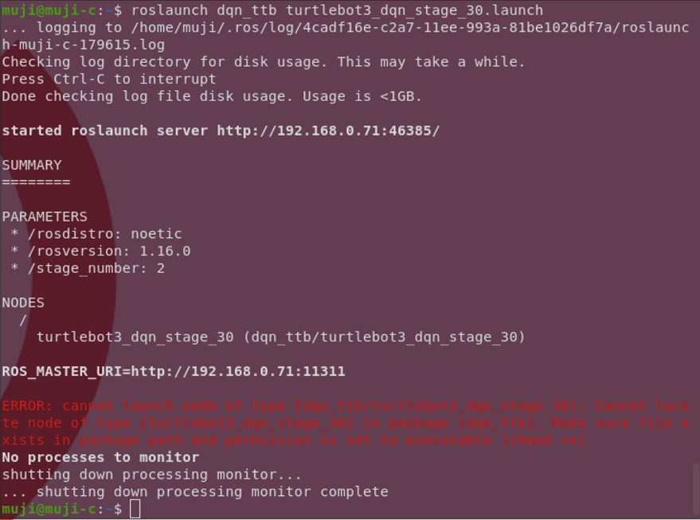

# Turtlebot3 Machine Learning

1. 터틀봇 DQN


# Description

로보티즈의 [공식 튜토리얼](https://emanual.robotis.com/docs/en/platform/turtlebot3/machine_learning/#machine-learning)에서 시작하였습니다.

모든 코드의 환경은 `ROS1`을 기반으로 하며 nn model들은 `PyTorch`를 이용하여 `CUDA toolkit`을 사용함을 기준으로 작성되었습니다.

추가적으로 기본 빌더(`catkin_make`)를 사용하지 않고  [`catkin_tools`](https://catkin-tools.readthedocs.io/en/latest/verbs/catkin_build.html)를 사용하였으며, 아래 설명에서 빌드 과정은 이를 기반으로 함을 밝힙니다.

# 1. Deep Q-Learning
코드는 로보티즈의 [머신러닝 튜토리얼](https://emanual.robotis.com/docs/en/platform/turtlebot3/machine_learning/#machine-learning) 코드와 [PyTorch(한국 사용자) DQN 튜토리얼](https://tutorials.pytorch.kr/intermediate/reinforcement_q_learning.html)을 기반으로 만들어졌습니다.


### YouTube

[YouTube Link](https://youtu.be/DUBrjx43RE8?si=EaVsYQ6waJKiJW0l)


### simulation

1. `ROS1` 패키지로 [Turtlebot3 Simulations](https://github.com/ROBOTIS-GIT/turtlebot3_simulations.git)와 [현재 리포지토리](https://github.com/redEddie/turtlebot3_machine_learning.git)를 `git clone` 해주세요.
   ```
   cd ~/catkin_ws/src
   git clone https://github.com/ROBOTIS-GIT/turtlebot3_simulations.git
   git clone https://github.com/redEddie/turtlebot3_machine_learning.git
   ```

1. `/turtlebot3_machine_learning`패키지 밑의 `/nodes`의 파일들은 실행가능한 파일로 속성을 변환해주세요.

   ```chmod +x turtlebot3_dqn_stage_1```

1. `ROS` 패키지를 빌드해주세요.
   ```catkin build```
1. 패키지를 소스해주세요.
   ```
   cd ~/catkin_ws
   source ./devel/setup.bash
   ```
1. `roslaunch turtlebot3_gazebo turtlebot3_dqn_stage_2.launch`
1. `roslaunch dqn_ttb turtlebot3_dqn_stage_30.launch`


# Possible Errors

1. 노드 파일들의 속성을 실행가능하도록 해주세요. 안 그러면 아래와 같은 에러를 얻게 됩니다.
   

1. `catkin_make`와 `catkin build`를 혼동하였을 수 있습니다. ([참고 링크](https://catkin-tools.readthedocs.io/en/latest/migration.html))

